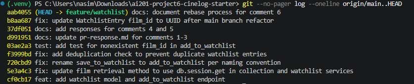

# PR Response Doc — CineLog Watchlist Feature

## AI Usage
Used AI as a devil's advocate on Comments 4 and 5 after writing my first drafts. For Comment 4, it pointed out that if most users never touch the privacy toggle, the visibility feature basically goes unused, which is a real cost I hadn't spelled out. I kept my position but added that a smaller number of users opting in on purpose is still better than everyone being exposed by default without realizing it. For Comment 5, it pointed out I'd asserted alphabetical sorting is useful for long lists without backing that up. I revised the reasoning to tie it to watchlist size specifically, alphabetical becomes more useful as the list grows, rather than just claiming it's generally better.

## Comment 1 — Rename
**What I did:** Renamed save_to_watchlist() to add_to_watchlist() in services/watchlist_service.py so it matches the verb_to_noun naming that add_to_collection() already uses. Also updated the one place it was called from, routes/watchlist/watchlist.py, both the import and the actual call.
**How I verified:** Searched the whole repo for save_to_watchlist to make sure nothing still referenced the old name (used Select String since I'm on PowerShell, not grep). Came back empty. Ran the test suite after too just to be safe.

## Comment 2 — Deduplication
**What I did:** Added an AlreadyInWatchlistError exception and a check for an existing entry before creating a new one in add_to_watchlist(). Basically copied the same approach add_to_collection() uses in collection_service.py, look up the film, look up if the entry already exists, and if it does, raise the error instead of just letting a duplicate get created.
**How I verified:** Ran the full test suite after making the change and everything still passed. I didn't write a dedicated duplicate test for this one since it wasn't explicitly asked for in Comment 3, but I could add one later if I have time (would be a good stretch test).

## Comment 3 — Missing test
**What I did:** Made a new file, tests/test_watchlist.py, and wrote test_add_to_watchlist_nonexistent_film_raises. Basically copied the structure of test_add_to_collection_nonexistent_film_raises from test_collection.py, same fixtures, same idea of checking that a fake film id raises FilmNotFoundError. One thing I changed: I used a fake integer (999999) instead of a fake UUID string, since Film.id is still an integer on this branch until the rebase happens in Comment 6. Will need to update this once that lands.
**How I verified:** Ran pytest tests/test_watchlist.py -v and it passed. Then ran the whole suite with pytest tests/ -v and all 5 passed.

## Comment 4 — Default visibility
**My position:** The default should be public=False, not public=True.
**Reasoning:** I'm optimizing for the user who hasn't made an active choice about visibility yet. A watchlist can reveal a lot about someone's mood or taste, and most users won't check the visibility setting before they start adding films. If it's public by default, the exposure already happens before they even think about it. Defaulting to private means someone who actually wants the social/discovery angle just has to flip it on, versus someone who wanted privacy having no way to undo already being visible.
**Tradeoff acknowledged:** The cost is discovery. If people don't bother flipping the toggle, the social value of watchlists mostly doesn't happen for most users. That's real, but I don't think it means the feature is pointless, some users will flip it, and those are the users actively choosing to be social with their list, which is arguably a better signal than everyone being public by default just because that's what they started with. I'd rather have a smaller number of users opt in on purpose than have everyone exposed by default and only some of them realize it.

## Comment 5 — Sort order
**My position:** Date-added should be the default, but users should have the option to sort alphabetically too, not just one or the other.
**Reasoning:** I agree that most people opening their watchlist want to see what they added recently, that's the more common use case and I don't have a good reason to fight it. But alphabetical still matters once a watchlist grows. A new user with five films doesn't need it, but someone who's been using CineLog for a while and has fifty films saved is going to have a harder time finding one specific title by scrolling through date order versus jumping to it alphabetically. So this isn't really pick-one, it's default for the common case, option for when the list gets big enough that lookup becomes the actual problem.
**Engagement with reviewer's point:** I'm not disagreeing with the reasoning, I think it's right that most users want recency by default. Where I'd push back a little is on treating this as fully either/or. Defaulting to date-added covers the common case, but it doesn't have to mean the alternative gets thrown out entirely, it just shouldn't be the default anymore.

## Comment 6 — Rebase
**What conflicted:** Running git rebase origin/main hit one real conflict: .gitignore, since both main and I had independently added one (mine from Milestone 1, main's from an earlier merged PR). Git flagged it as an add/add conflict. The actual UUID refactor didn't cause a text conflict since my WatchlistEntry model was added at the end of models.py while main's refactor touched the top of the file, so git merged them cleanly without flagging anything, even though the result was actually broken.
**How I resolved it:** For the .gitignore conflict, I combined both versions since they didn't really disagree, main just had one extra line (.pytest_cache/) mine didn't. After resolving that, the rebase finished with no further conflicts, but running the test suite afterward showed an ImportError because my WatchlistEntry model had disappeared from models.py during the merge. I manually added it back in, this time with film_id typed as db.String(36) instead of db.Integer to match the new UUID Film.id, and set public to default False to match my Comment 4 decision. I also updated stale docstrings in watchlist_service.py and routes/watchlist/watchlist.py that still described film_id as an int, and changed the fake film id in test_watchlist.py from an integer to a UUID-shaped string so the test actually reflects the current schema instead of accidentally passing for the wrong reason.
**How I verified no conflict remains:** Ran git log --oneline to confirm the branch is a clean linear history on top of main with no merge commits. Ran pytest tests/ -v and got all 5 tests passing.

## Commit History Screenshot

## PR Description
## What this feature does

Adds a watchlist feature to CineLog so users can save films they want to watch later, separate from their collection of films they've already watched. Includes a new WatchlistEntry model, service functions (add_to_watchlist, get_watchlist), and REST endpoints (GET /watchlist/<user_id>, POST /watchlist/<user_id>/add).

## Design decisions

**Default visibility (public field):** Watchlists default to private (public=False) rather than public. This optimizes for users who haven't made an active choice about visibility yet, since a watchlist can reveal personal taste or mood, and most users won't check privacy settings before adding films. Users who want the social/discovery benefit can opt in by setting public=True explicitly. The tradeoff is reduced organic discovery if few users flip the toggle, but I'd rather have a smaller number of users opt in on purpose than expose everyone by default.

**Sort order:** get_watchlist() defaults to date-added order (most recent first) rather than alphabetical, per the reviewer's preference, since most users want to see what they added recently. Alphabetical sorting is still valuable once a list grows large enough that finding a specific title by scrolling becomes tedious, so this isn't strictly either/or, date-added is the default, with alphabetical available as an option for larger lists.

## How to manually test

1. Start the app: `python app.py`
2. Create a user and film via the existing endpoints (or use the test fixtures as a reference for the expected shape).
3. Add a film to a user's watchlist: 
curl -X POST http://127.0.0.1:5000/watchlist/<user_id>/add -H "Content-Type: application/json" -d "{"film_id": "<film_id>"}"
4. View the watchlist:
curl http://127.0.0.1:5000/watchlist/<user_id>
5. Try adding the same film twice, confirm the second request returns an error instead of creating a duplicate entry.
6. Try adding a film_id that doesn't exist, confirm a FilmNotFoundError-style response instead of a server crash.
7. Run the automated test suite: `pytest tests/ -v`, all 5 tests should pass.